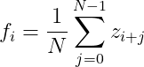
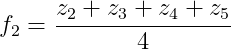
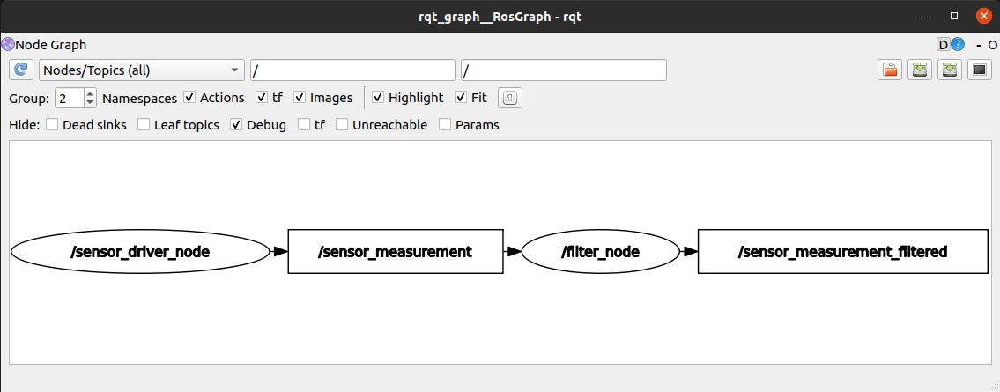

# Day 1 Bonus Assignment Internship2 Dagozilla

## Table of Content
  - [Table of Content](#table-of-content)
  - [Description](#description)
  - [Implementation](#implementation)
  - [How to Run](#how-to-run)
    - [Prerequisite](#prerequisite)
    - [Running Steps](#running-steps)
    - [Note](#note)
  - [Author](#author)
  - [References](#references)

## Description
Measurements acquired by sensors can sometimes be noisy. Using this raw data directly for computation can cause unwanted robot behaviour. To alleviate this problem, some filters might be of use.

One such filter is **Simple Moving Average Filter**. This filter smooths out data by convolution. It averages *N* most recent measurements as described by the following equation:

<p align="center">
  ,
</p>

where *f_i* is the *i*-th data returned by the filter and *z_k* is the *k*-th data from the measurement stream.

For example, to calculate the 2nd data point returned by a filter of *N*=4, we get

<p align="center">
  .
</p>

To illustrate:

<p align="center">
  
</p>

## Implementation
- Here I implement 2 Node, Sensor Driver Node (publisher) and Filter Node (publisher and subscriber). Both of them are using Float64 message, where Sensor Driver Node publish messages (raw data) to `/sensor_measurement` topic and Filter Node subscribe to that topic. Filter Node then filter data that it gets and publish messages (filtered data) to `/sensor_measurement_filtered` topic. 

- Sensor Driver Node publish message that is sensor measurement z_i where value of z_i is given by the formula: `z_i = sin(i * pi / 180) + g`, where g is a random number with Gaussian distribution of mean=0.0 and sigma=0.05. This node loop frequency is 100 Hz and implemented in Python

- Filter Node publish messages whose content is f_i (as explained above). Here I use N=5 as default and we can change it using parameter server. This node loop frequency is 100 Hz and implemented in C++.

    ### Header File
    - Here I also implement [my own header file](src/moving_average_filter/include/moving_average_filter/filter_node.h) so that my codes are neater. My header file contains my class attributes and methods declaration also their brief functionality explanations.

    ### Computation Graph
    - Here the computation graph of my ROS package
    

## How to Run
### Prerequisite
- Already installed ROS (here I use ROS noetic)

### Running Steps
1. Download or clone this repository
    ```sh
    git clone https://gitlab.com/dagozilla/academy/2021-internship2/16520299/day-1-bonus.git
    ```
2. Change directory to `16520299` folder
    ```sh
    cd day-1-bonus/16520299
    ```
3. Compile ROS package
    ```
    catkin_make
    ```
    If you get error, see [Note](#note)
4. Run ROS package
    - Open new terminal (terminal1) and run
        ```
        roscore
        ```
    - Open new terminal again (terminal2) and run Filter Node
        ```
        source devel/setup.bash
        rosrun moving_average_filter filter_node
        ```
    - Open new terminal again (terminal3) and run Sensor Driver Node
        ```
        source devel/setup.bash
        rosrun moving_average_filter sensor_driver_node.py
        ```
    ### Parameter Server
    - We can define our N (number of data that we averaged) by using parameter server. Before running Filter Node, run this command
        ```
        rosparam set /size_N <int_number>
        ```
    ### Rostopic
    - We can see message published by Filter Node by subscribing to `/sensor_measurement_filtered` topic. Open new terminal (terminal4) and run this command
        ```
        rostopic echo /sensor_measurement_filtered
        ```
    
    ### Computation Graph
    - Prerequisite : already installed rqt package
    - Open new terminal (terminal5) and run this command
        ```
        rqt_graph
        ```

### Note
- Previously I often tested my program at 0.2Hz rate and I often (only) missed the first message. This is said to be expected behavior (see [this](https://answers.ros.org/question/287548/ros_tutorials-roscpp-talkerlistener-loses-first-message-or-two/?answer=287676#post-id-287676)). But when I try with 100Hz rate, I miss the first 15 messages. I don't know why this happens and maybe it's related to the looping rate.

- In case when compiling ROS package there is error "*The dependency target "moving_average_filter_filter_node_cpp" of target "filter_node" does not exist.*", just run `catkin_make` again. I don't know why but it works fine after that.

## Author
- Malik Akbar Hashemi Rafsanjani

## References
- ["ROS Wiki"](http://wiki.ros.org/). *ROS Community*.  Retrieved 24 June 2021.
- ["ROS Overview & Tutorial"](https://docs.google.com/presentation/d/1mbuUwuboY-xZHHEYSMAoZwKoJgCuIzn2RNmxc9QfChs/edit#slide=id.ge0b649f60e_0_30). *Dagozilla*. Retrieved 24 June 2021.
- ["ros_tutorials roscpp talker/listener loses first message or two"](https://answers.ros.org/question/287548/ros_tutorials-roscpp-talkerlistener-loses-first-message-or-two/?answer=287676#post-id-287676). *ROS answer*. Retrieved 24 June 2021.
- ["OOP with ROS in Cpp"](https://roboticsbackend.com/oop-with-ros-in-cpp/). *The Robotics Back-End*. Retrieved 24 June 2021.
- ["[ROS] Include a Cpp header from another package"](https://roboticsbackend.com/ros-include-cpp-header-from-another-package/). *The Robotics Back-End*. Retrieved 24 June 2021.