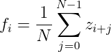
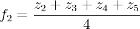

# Day 1 Bonus Assignment Specification

## Description
Measurements acquired by sensors can sometimes be noisy. Using this raw data directly for computation can cause unwanted robot behaviour. To alleviate this problem, some filters might be of use.

One such filter is **Simple Moving Average Filter**. This filter smooths out data by convolution. It averages *N* most recent measurements as described by the following equation:

  ,

where *f_i* is the *i*-th data returned by the filter and *z_k* is the *k*-th data from the measurement stream.

For example, to calculate the 2nd data point returned by a filter of *N*=4, we get

  .

To illustrate:

  

## Your Task

Create 2 ROS nodes, one that acts as a sensor driver and another that is the filter. Computation graph will look something like this:

  

The details of each node are as follows:

### Sensor Driver Node
- Publishes message of type float64 to `/sensor_measurement` topic.
  - Message content is a random floating point number that represents a sensor measurement *z_i*.
- Node loop frequency is 50Hz.
- Implementation in Python.

### Filter Node
- Subscribes to `/sensor_measurement` topic.
- Publishes message of type float64 to `/sensor_measurement/filtered` topic.
  - Message content is *f_i*. Use *N*=5.
- Node loop frequency is 50Hz.
- Implementation in C++.

## Deliverables
1. Create a ROS workspace and implement your solution there.
2. Fork this repository into your GitLab group.
3. Create a `development` branch in the forked repository.
4. Create a folder with your TPB NIM as the folder name.
5. Copy the `src` folder from the workspace into your TPB NIM folder (**do not commit the `build` and `devel` folders**).
6. Create a README inside your TPB NIM folder to explain your work and how to run it.
6. Submit your work after the due date by creating a merge request (MR) to [this repository's master branch](https://gitlab.com/dagozilla/academy/2021-internship2/assignment/day-1-bonus).
7. Cite references you used in this assignment.

## Assessment Criteria
1. Correctness of the implementation.
2. Code cleanliness.
3. Documentations.
4. Git best practices.
